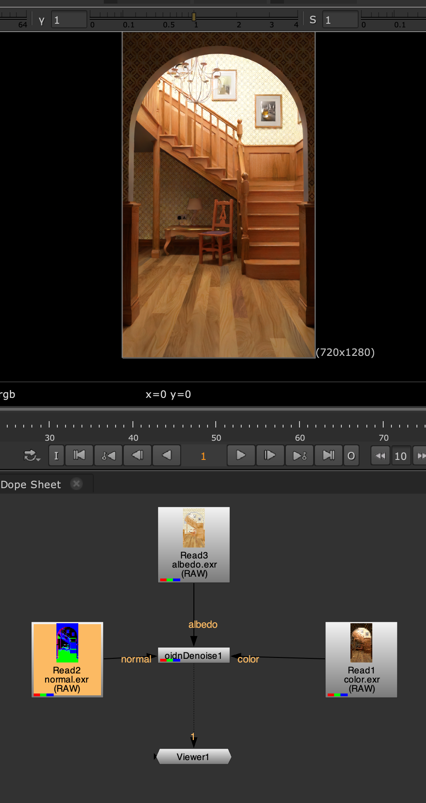

# Nuke oidnDenoise

This is a Nuke plugin for denoising images rendered with ray tracing using latest version of Intel's Open Image Denoise library.

Compared to [NukeCGDenoiser](https://github.com/mateuszwojt/NukeCGDenoiser.git), oidnDenoise provides more parameters and more accurate results.

<div style="display: flex;">
  
  
</div>

## Requirements

- CMake 3.10 or later
- Nuke 14.x/15.x/16.x
- [Intel's OpenImageDenoise 2.x](https://github.com/OpenImageDenoise/oidn)

This plugin should compile fine on Windows, Linux and MacOS. 

- This plugin was tested on Nuke 15.0v1 / MacOS Sonoma 14.5 (Apple M2) with Open Image Denoise v2.3.3.

- This plugin was tested on Nuke 15.0v1 / Windows 10 with Open Image Denoise v2.3.3.

- This plugin was tested on Nuke 15.2v4 / Ubuntu 22.04.5 LTS x86_64 with Open Image Denoise v2.3.3.


## Building

### MacOS

```
curl -OL https://github.com/RenderKit/oidn/releases/download/v2.3.3/oidn-2.3.3.arm64.macos.tar.gz

tar xvf oidn-2.3.3.arm64.macos.tar.gz

git clone https://github.com/twins-annning/NukeOIDNDenoise.git

cd NukeOIDNDenoise

mkdir build && cd build

cmake -DOIDN_ROOT=/path/to/oidn-2.3.3.arm64.macos ..

make && make install


Optionally,

// when MacOS is x86_64
// curl -OL https://github.com/RenderKit/oidn/releases/download/v2.3.3/oidn-2.3.3.x86_64.macos.tar.gz

// when set Nuke path manually
// cmake -DOIDN_ROOT=/path/to/oidn-2.3.3.arm64.macos -DCMAKE_PREFIX_PATH=/Applications/Nuke15.0v1/Nuke15.0v1.app/Contents/MacOS ..

```

### Windows

```
curl -OL https://github.com/RenderKit/oidn/releases/download/v2.3.3/oidn-2.3.3.x64.windows.zip
unzip oidn-2.3.3.x64.windows.zip

git clone https://github.com/twins-annning/NukeOIDNDenoise.git

cd NukeOIDNDenoise

mkdir build && cd build

cmake -G "Visual Studio 16 2019" -DCMAKE_PREFIX_PATH="/path/to/NukePATH"  -DOIDN_ROOT=/path/to/oidn-2.3.3.x64.windows  -DCMAKE_BUILD_TYPE=Release ..

cmake --build . --config Release

cmake --install . --config Release


Optionally,

// If Nuke crashes when launching the oidenDenoise plugin.
// Maybe need to compile oidn-2.3.3

install ispc-v1.27.0-windows

add \path\to\ispc-v1.27.0-windows\bin to Environment PATH 

install intel-onetbb-2022.2.0.506_offline.exe 

add \path\to\Intel\oneAPI\tbb\2022.2\bin to Environment PATH

// URLs:
https://github.com/ispc/ispc/releases/download/v1.27.0/ispc-v1.27.0-windows.zip
https://registrationcenter-download.intel.com/akdlm/IRC_NAS/d6497040-a73d-435a-a018-a6040bdf39ec/intel-onetbb-2022.2.0.506_offline.exe

// download and extract oidn-2.3.3.src.tar.gz
curl -OL https://github.com/RenderKit/oidn/releases/download/v2.3.3/oidn-2.3.3.src.tar.gz

cd oidn-2.3.3

mkdir build && cd build

cmake -G "Visual Studio 16 2019" -DCMAKE_BUILD_TYPE=Release ..
cmake --build . --config Release

// Important
- move Release folder to oidn-2.3.3

- Rename Release to lib

- add path/to/oidn-2.3.3/lib to Environment PATH

// install Nuke oidnDenoise
cmake -G "Visual Studio 16 2019" -DCMAKE_PREFIX_PATH="/path/to/NukePATH"  -DOIDN_ROOT=/path/to/oidn-2.3.3  DCMAKE_BUILD_TYPE=Release ..

cmake --build . --config Release

cmake --install . --config Release

```

### Ubuntu

```
sudo apt install cmake
sudo apt install curl
sudo apt install build-essential
sudo apt install libglfw3-dev libgl1-mesa-dev libglu1-mesa-dev

curl -OL https://github.com/RenderKit/oidn/releases/download/v2.3.3/oidn-2.3.3.x86_64.linux.tar.gz

tar xvf oidn-2.3.3.x86_64.linux.tar.gz

git clone https://github.com/twins-annning/NukeOIDNDenoise.git

cd NukeOIDNDenoise

mkdir build && cd build

cmake -DOIDN_ROOT=/path/to/oidn-2.3.3.x86_64.linux ..

make && make install


Optionally,

# if can not find Nuke
# add -DCMAKE_PREFIX_PATH=/path/to/your Nuke installation Path
# for example -DCMAKE_PREFIX_PATH=/path/to/Nuke15.2v4

# cmake -DOIDN_ROOT=/path/to/oidn-2.3.3.x86_64.linux -DCMAKE_PREFIX_PATH=/path/to/NukePATH ..

```


## Usage

### Parameters

[Parameters supported by the OIDN](https://github.com/RenderKit/oidn?tab=readme-ov-file#rt)


### Input

- color only

- color and albedo and normal


## Acknowledgments

Mateusz Wojt and your Nuke node [NukeCGDenoiser](https://github.com/mateuszwojt/NukeCGDenoiser.git)

Thank you for your great work. Just have referenced a lot of your code, was like standing on the shoulder of giants.


